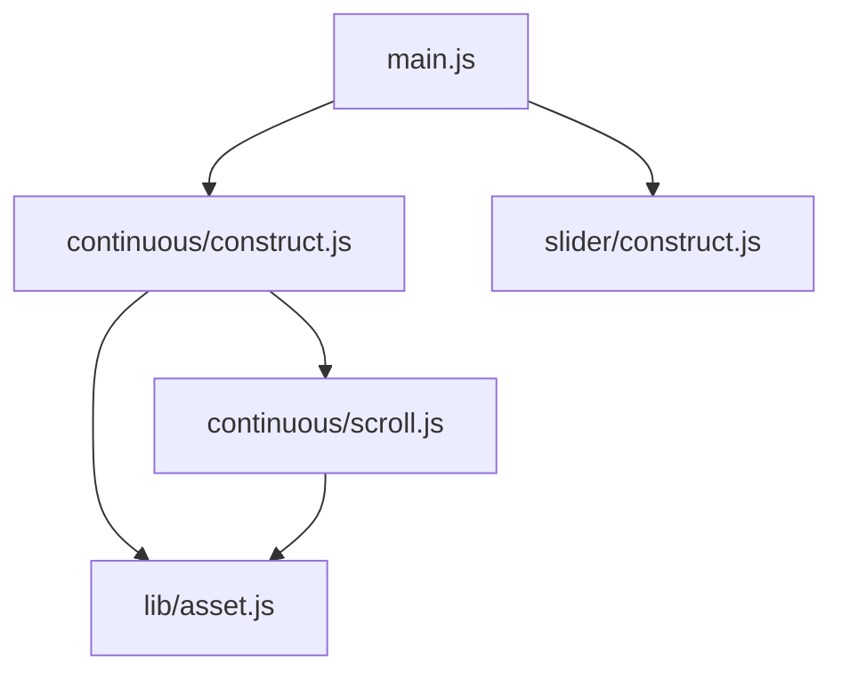
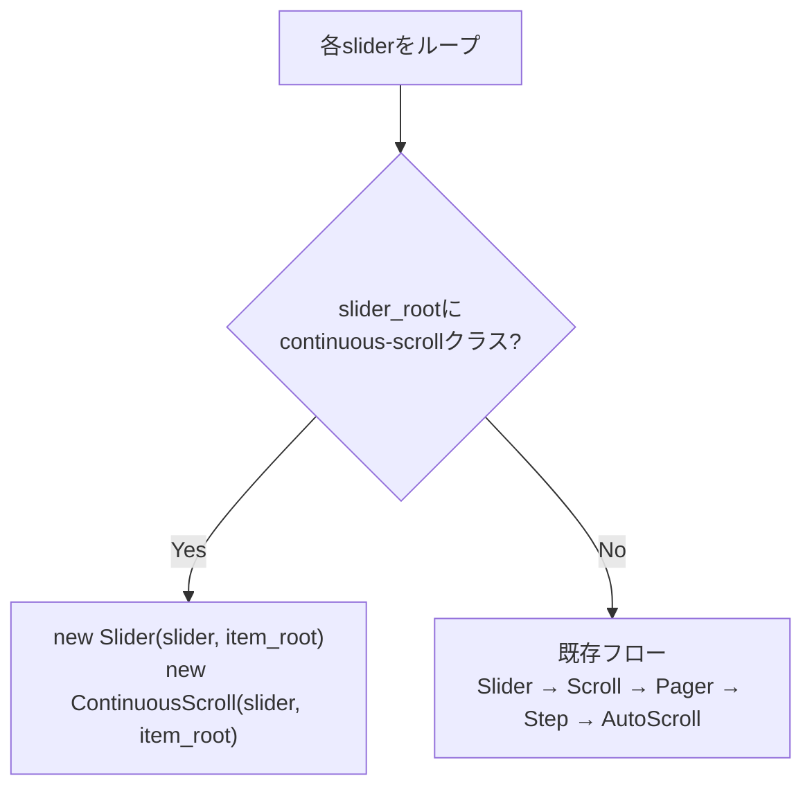
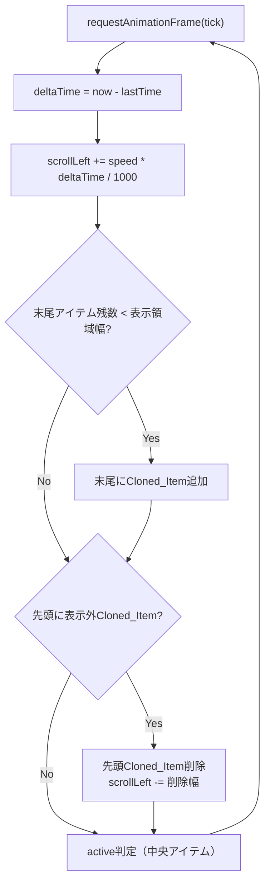

# 設計ドキュメント: Continuous Scroll（連続スクロール）

## 概要

MYNT Sliderライブラリに「連続スクロール（continuous-scroll）」モードを追加する。
既存の`auto-scroll`（タイマーベースの間欠ジャンプ移動）とは異なり、`requestAnimationFrame`ループによるマーキー的な一定速度連続スクロールを実現する。

新規モジュールは`js/continuous/`ディレクトリに配置し、既存モジュール（`scroll/`、`pager/`、`step/`、`auto/`）とは完全に独立させる。共通依存は`js/lib/asset.js`のみとする。

HTMLクラス`continuous-scroll`の有無で有効化を判定し、有効時は既存の`Scroll`/`Pager`/`Step`/`AutoScroll`のインスタンス化をスキップする。

## アーキテクチャ

### モジュール構成

```
js/
├── main.js                    # エントリーポイント（分岐ロジック追加）
├── continuous/                # 新規モジュール
│   ├── construct.js           #   初期化・クラス判定・CSS適用
│   └── scroll.js              #   rAFループ・速度制御・無限ループ・active切替
└── lib/
    └── asset.js               #   共通定数（既存・変更なし）
```

### 依存関係



`continuous/`モジュールは`lib/asset.js`のみに依存し、`scroll/`、`pager/`、`step/`、`auto/`のいずれもimportしない。

### main.jsの分岐フロー



`continuous-scroll`クラスが存在する場合、`Slider`（DOM初期構築・UUID付与・index設定・アイテム複製）は引き続き実行する。これにより`data-index`属性の付与と初期アイテム複製が行われ、連続スクロールモジュールはこの前提に依存できる。

## コンポーネントとインターフェース

### `js/continuous/construct.js` - ContinuousConstruct

連続スクロールモードの初期化を担当するエントリーポイント。

```javascript
export class Construct {
  constructor(slider_root, item_root)
}
```

責務:
- `slider_root`に`continuous-scroll`クラスがあるか判定
- CSSスタイルの適用（`scroll-snap-type: none`、`pointer-events: none`、`overflow: hidden`）
- `.prev`、`.next`、`.pager`要素への`pointer-events: none`適用
- `Scroll`クラスのインスタンス化

初期化時のCSS適用:
| 対象 | プロパティ | 値 |
|---|---|---|
| `item_root`（`.slider`） | `scroll-snap-type` | `none` |
| `item_root`（`.slider`） | `pointer-events` | `none` |
| `item_root`（`.slider`） | `overflow` | `hidden` |
| `.prev`、`.next`、`.pager` | `pointer-events` | `none` |

### `js/continuous/scroll.js` - ContinuousScroll

rAFループによる連続スクロール・無限ループ・active切替を担当する。

```javascript
export class Scroll {
  constructor(slider_root, item_root)
}
```

責務:
- `data-scroll-speed`属性の解析（デフォルト: 50px/秒）
- `requestAnimationFrame`ループの開始・維持
- deltaTimeベースの速度制御（フレームレート非依存）
- 末尾アイテム不足時のCloned_Item追加
- 先頭側の不要なCloned_Item削除と`scrollLeft`補正
- 中央判定によるactive切替
- `window.resize`イベントでのバッファ量再計算

#### rAFループの処理フロー



#### 速度制御

```
scrollLeft += speed_px_per_sec * (deltaTime_ms / 1000)
```

- `speed_px_per_sec`: `data-scroll-speed`属性値（デフォルト50）
- `deltaTime_ms`: 前フレームからの経過時間（ミリ秒）
- フレームレートが変動しても一定速度を維持

#### 無限ループのアイテム管理

末尾追加の判定:
- `item_root.scrollLeft + item_root.offsetWidth * 2` が `item_root.scrollWidth` を超える場合、末尾にアイテムが不足
- Original_Itemの`data-index`順に従い、次のインデックスのアイテムを`cloneNode(true)`で複製して`appendChild`

先頭削除の判定:
- 先頭のアイテムが`item_root.scrollLeft`から表示領域幅以上離れている場合、不要と判定
- 削除前にアイテムの`offsetWidth`を記録し、削除後に`scrollLeft`を同量減算して視覚的ジャンプを防止

#### active切替ロジック

```
center_pos = item_root.scrollLeft + item_root.offsetWidth / 2
```

全子要素を走査し、`item.offsetLeft <= center_pos < item.offsetLeft + item.offsetWidth`を満たすアイテムをactiveとする。既存の`scroll/set_active.js`と同等のロジックだが、Pager同期は行わない（連続スクロール時はPagerが無効化されるため）。

#### resizeイベント処理

`window`の`resize`イベントをリスンし、以下を実行:
1. 新しい`item_root.offsetWidth`に基づきバッファ量（必要アイテム数）を再計算
2. 不足分があれば末尾にCloned_Itemを追加
3. 過剰分があれば先頭側から削除し`scrollLeft`を補正

### `css/style.css` への追加CSS

```css
.mynt-slider.continuous-scroll .slider {
  scroll-snap-type: none;
  pointer-events: none;
  overflow: hidden;
}

.mynt-slider.continuous-scroll .prev,
.mynt-slider.continuous-scroll .next,
.mynt-slider.continuous-scroll .pager {
  pointer-events: none;
}
```

設計判断: CSSでの静的適用とJavaScriptでの動的適用を併用する。CSSはページ読み込み直後のちらつき防止（FOUC対策）、JavaScriptは動的なクラス変更への対応を担う。

### `js/main.js` の変更

```javascript
import { Construct as ContinuousScroll } from "./continuous/construct.js"

// init()内のループ:
for(const slider of sliders){
  const item_root = slider.querySelector(Asset.item_root_selector)
  if(!item_root){continue}
  new Slider(slider, item_root)

  if(slider.classList.contains("continuous-scroll")){
    new ContinuousScroll(slider, item_root)
  } else {
    new Scroll(item_root)
    new Pager(slider, item_root)
    new Step(slider)
    new AutoScroll(slider)
  }
}
```

## データモデル

### DOM属性（既存・変更なし）

| 属性 | 対象 | 説明 |
|---|---|---|
| `data-uuid` | `.mynt-slider` | スライダー識別UUID（`slider/construct.js`が付与） |
| `data-index` | `.slider > *` | アイテムの元インデックス（`slider/construct.js`が付与） |

### DOM属性（新規・参照のみ）

| 属性 | 対象 | 説明 | デフォルト |
|---|---|---|---|
| `data-scroll-speed` | `.mynt-slider` | スクロール速度（px/秒） | `50` |

### CSSクラス（新規・参照のみ）

| クラス | 対象 | 説明 |
|---|---|---|
| `continuous-scroll` | `.mynt-slider` | 連続スクロールモード有効化 |

### Scrollクラスの内部状態

| プロパティ | 型 | 説明 |
|---|---|---|
| `speed` | `number` | スクロール速度（px/秒） |
| `last_time` | `number` | 前フレームのタイムスタンプ（ms） |
| `original_indexes` | `number[]` | Original_Itemの`data-index`一覧 |
| `append_index` | `number` | 次に末尾追加するOriginal_Itemのインデックス |
| `raf_id` | `number` | `requestAnimationFrame`の戻り値（将来の停止用） |


## 正当性プロパティ（Correctness Properties）

*プロパティとは、システムのすべての有効な実行において真であるべき特性や振る舞いのことである。プロパティは、人間が読める仕様と機械的に検証可能な正当性保証の橋渡しとなる。*

### Property 1: スクロール増分はdeltaTimeに比例する

*For any* 正の速度値`speed`（px/秒）と正のdeltaTime値`dt`（ミリ秒）に対して、1フレームあたりのスクロール増分は `speed * dt / 1000` と等しくなければならない。

**Validates: Requirements 2.2**

### Property 2: 速度パース（数値・非数値のフォールバック）

*For any* 文字列値に対して、`parseFloat`で有限の正の数値に変換できる場合はその数値をスクロール速度として使用し、変換できない場合（`NaN`、`Infinity`、負数、空文字列、非数値文字列）はデフォルト値50を使用しなければならない。

**Validates: Requirements 3.1, 3.2, 3.3**

### Property 3: 末尾追加によるバッファ充足

*For any* スクロール状態において、末尾追加ロジック実行後、Item_Rootの末尾側の残りアイテム幅の合計は表示領域幅（`item_root.offsetWidth`）以上でなければならない。

**Validates: Requirements 6.1**

### Property 4: 先頭削除時のscrollLeft補正（視覚位置保存）

*For any* 先頭側のCloned_Item削除操作において、削除されたアイテムの合計幅を`W`とすると、削除後の`scrollLeft`は削除前の`scrollLeft - W`と等しくなければならない。これにより視覚的なジャンプが発生しない。

**Validates: Requirements 6.2, 6.3**

### Property 5: バッファ計算は表示領域幅に比例する

*For any* 表示領域幅`viewport_width`とアイテム幅`item_width`（ともに正の値）に対して、必要バッファアイテム数は `ceil(viewport_width / item_width) + 1` 以上でなければならない。

**Validates: Requirements 6.4**

### Property 6: activeアイテムの一意性と中央位置の正確性

*For any* スクロール位置とアイテムレイアウトにおいて、`active`クラスを持つアイテムはちょうど1つだけ存在し、そのアイテムは中央座標（`scrollLeft + offsetWidth / 2`）を含む位置にあるアイテムでなければならない。

**Validates: Requirements 7.1, 7.2**

## エラーハンドリング

### 初期化時のガード

| 条件 | 対応 |
|---|---|
| `item_root`が`null` | 即座にreturn、何も処理しない |
| `item_root`に子要素がない | 即座にreturn、rAFループを開始しない |
| `continuous-scroll`クラスなし | `construct.js`で判定し、即座にreturn |
| `data-scroll-speed`が非数値 | デフォルト値50px/秒を使用 |
| `data-scroll-speed`が0以下 | デフォルト値50px/秒を使用 |

### rAFループ内のエラー対策

| 条件 | 対応 |
|---|---|
| `deltaTime`が異常に大きい（例: タブ非表示後の復帰） | 上限値（例: 100ms）でクランプし、大きなジャンプを防止 |
| 中央位置にアイテムが見つからない | active切替をスキップし、前回のactiveを維持 |
| `cloneNode`対象のOriginal_Itemが見つからない | 複製をスキップ |

### resizeイベント

| 条件 | 対応 |
|---|---|
| resize中の高頻度呼び出し | 即座に再計算（debounce不要、計算コストが低いため） |

## テスト戦略

### テストアプローチ

本プロジェクトはビルドツール・テストフレームワークなしのVanilla JS環境であるため、以下の方針でテストを構成する。

#### プロパティベーステスト

- ライブラリ: [fast-check](https://github.com/dubzzz/fast-check)（`<script type="module">`でCDN経由で読み込み）
- 各プロパティテストは最低100回のイテレーションで実行
- 各テストにはコメントで設計ドキュメントのプロパティを参照するタグを付与
- タグ形式: `Feature: continuous-scroll, Property {number}: {property_text}`

#### ユニットテスト

- 特定のシナリオ・エッジケース・統合ポイントの検証に使用
- プロパティテストと相補的に使用し、網羅的なカバレッジを実現

### プロパティテスト対象

| Property | テスト内容 | 生成する入力 |
|---|---|---|
| Property 1 | `calcIncrement(speed, dt)`の戻り値が`speed * dt / 1000`と等しい | 正の`speed`（0.1〜500）、正の`dt`（1〜100） |
| Property 2 | `parseSpeed(value)`が数値なら数値を、非数値なら50を返す | 任意の文字列（数値文字列、非数値文字列、空文字列、特殊値） |
| Property 3 | 末尾追加後の残りアイテム幅 >= 表示領域幅 | ランダムなスクロール位置、アイテム数、アイテム幅 |
| Property 4 | 先頭削除後の`scrollLeft` = 削除前`scrollLeft` - 削除幅 | ランダムな先頭アイテム数、アイテム幅、初期scrollLeft |
| Property 5 | バッファ計算結果 >= `ceil(viewport / item_width) + 1` | 正の`viewport_width`、正の`item_width` |
| Property 6 | activeアイテムが1つだけ存在し、中央座標を含む | ランダムなアイテムレイアウト、スクロール位置 |

### ユニットテスト対象

| テスト | 検証内容 | 対応要件 |
|---|---|---|
| 初期化テスト | `continuous-scroll`クラスありで初期化される | 1.1 |
| 非活性テスト | `continuous-scroll`クラスなしで何もしない | 1.2 |
| 競合テスト | `continuous-scroll`と`auto-scroll`両方で`continuous-scroll`のみ有効 | 1.3 |
| CSS適用テスト | 初期化後に必要なCSSプロパティが全て適用されている | 4.1, 4.2, 4.3, 5.1 |
| デフォルト速度テスト | `data-scroll-speed`なしで速度が50 | 3.2 |
| モジュール分岐テスト | `continuous-scroll`時にScroll/Pager/Step/AutoScrollがスキップされる | 8.4, 9.2 |
| 後方互換テスト | `continuous-scroll`なしで既存フローが変更なく実行される | 9.3 |
| resize追加テスト | viewport拡大時にアイテムが追加される | 6.5 |
| resize削除テスト | viewport縮小時にアイテムが削除されscrollLeftが補正される | 6.6 |

### テストの実行方法

テストファイルはHTMLページとして作成し、ブラウザで直接実行する。fast-checkはESM CDN（例: `https://esm.sh/fast-check`）から読み込む。

```html
<script type="module">
import fc from 'https://esm.sh/fast-check'
// テストコード
</script>
```
